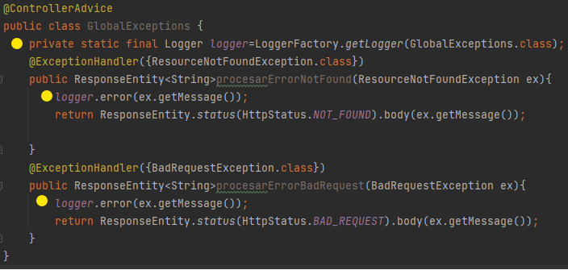
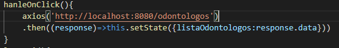
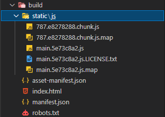
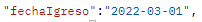

- ALGUNAS ESPECIFICACIONES SOBRE EL PROYECTO:
- 1: Debido a problemas con el log4j y un error al tratar de crear archivo donde se guardarán todos los log,opte por buscar una solución algo rebuscada para poder imprimir los logs por consola :los logs se lanzan en com.example.demo.exception.GlobalException

- 2:VISTAS
- las vistas se hicieron en react donde se consumía la Api mediante el método de axios 
- 
- para poder integrar el codigo react con nuestro proyecto, se utlizo el sigien comando "npm run-script build"   lo cual nos creaba un archivo build el cual luego copie y pegue en resources.static
- 
- SECURITYcONFIGURATION
- ADMIN : username:daniel@gmail.com   -- password:soyadmin
- USER: username:andres@gmail.com -- password:digital

- se recomienda antes de ir a la vista , agregar un paciente , un odontólogo y un turno mediante Postman, debido a que la única funcionalidad que maneja la vista es la de listar odontólogos,pacientes y turnos , debido a que este era el mínimo requerimiento para las vistas
- a la hora de agregar un paciente mediante Postman - a la hora de definir la fecha de ingreso, no colocar “fechaIngreso” en el Json, si no colocar “fechaIgreso” debido a un error de escritura del cual me di una vez finalizado el proyecto 
- 